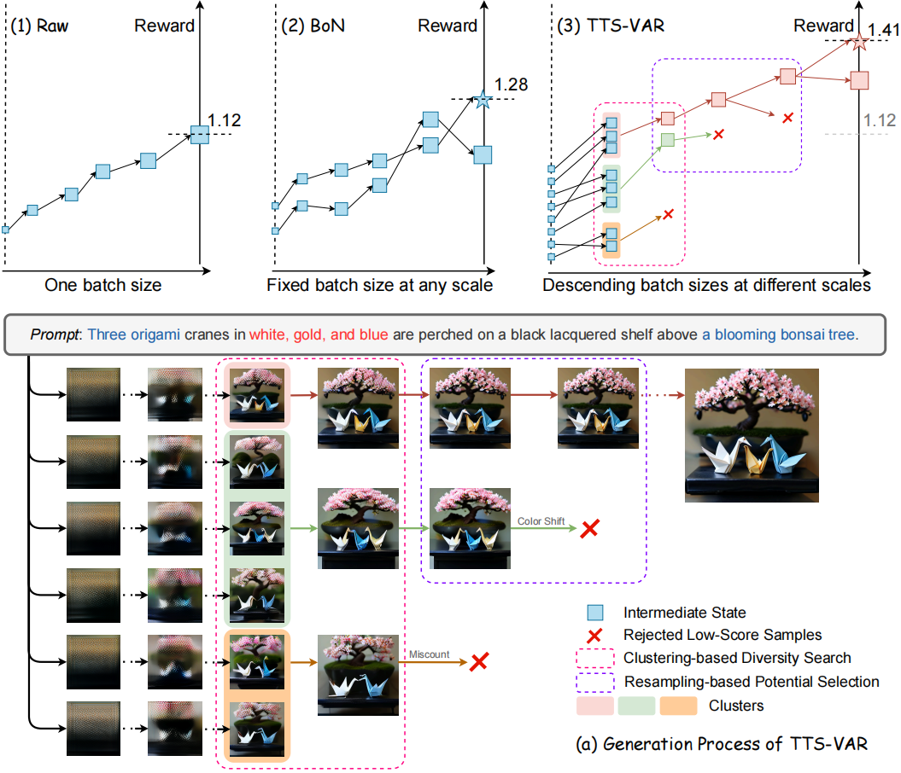

# TTS-VAR: A Test-Time Scaling Framework for Visual Auto-Regressive Generation

[](https://arxiv.org/abs/2507.18537)   

**A Test-Time Scaling Framework for Visual Auto-Regressive Generation\[[Paper](https://arxiv.org/abs/2507.18537)\]**

[Zhekai Chen](https://zhekai-chen.github.io/), [Ruihang Chu](https://ruihang-chu.github.io/), [Yukang Chen](https://yukangchen.com), [Shiwei Zhang](https://scholar.google.com/citations?user=ZO3OQ-8AAAAJ&hl=zh-CN), [Yujie Wei](https://weilllllls.github.io/), [Yingya Zhang](https://scholar.google.com/citations?user=16RDSEUAAAAJ), [Xihui Liu](https://xh-liu.github.io/)

Scaling visual generation models is essential for real-world content creation, yet requires substantial training and computational expenses. Alternatively, test-time scaling has garnered growing attention due to resource efficiency and promising performance. In this work, we present TTS-VAR, the first general test-time scaling framework for visual auto-regressive (VAR) models, modeling the generation process as a path searching problem.



To dynamically balance computational efficiency with exploration capacity, we first introduce an adaptive descending batch size schedule throughout the causal generation process.Besides, inspired by VAR's hierarchical coarse-to-fine multi-scale generation, our framework integrates two key components: (i) At coarse scales, we observe that generated tokens are hard for evaluation, possibly leading to erroneous acceptance of inferior samples or rejection of superior samples. Noticing that the coarse scales contain sufficient structural information, we propose clustering-based diversity search. It preserves structural variety through semantic feature clustering, enabling later selection on samples with higher potential. (ii) In fine scales, resampling-based potential selection prioritizes promising candidates using potential scores, which are defined as reward functions incorporating multi-scale generation history.

Experiments on the powerful VAR model Infinity show a notable 8.7% GenEval score improvement (0.69→0.75). Key insights reveal that early-stage structural features effectively influence final quality, and resampling efficacy varies across generation scales.

## News

* [X] [2025.7.24] We release [Paper](https://arxiv.org/abs/2507.18537) and Github repo [TTS-VAR](https://github.com/ali-vilab/TTS-VAR).

## Quick Start

1. Prepare the environment
   ```bash
   cd TTS-VAR
   conda create -n tts-var python==3.10.12
   conda activate tts-var
   ```
2. Clone submodule [Infinity](https://github.com/FoundationVision/Infinity)
   ```bash
   git submodule init
   git submodule update
   ```
3. Install dependencies
   ```bash
   cd Infinity
   pip install torch==2.5.1
   pip install -r requirements.txt

   cd ..
   pip install -r requirements.txt
   ```
4. Download the pretrained models and put it in `./pretrained_models/`
   ```bash
   git-lfs install
   bash download_models.bash
   ```
5. Inference with TTS-VAR
   ```bash
   bash run.bash
   ```

## Inference Args

The inference arguments are list in `run.bash`, with specific explanation in `tts-var/main.py`. Here we show arguments for TTS-VAR. For Infinity's arguments, please refer to [Infinity](https://github.com/FoundationVision/Infinity).

### Process Arguements

| Argument           | Description                                                   | Default                                     | Explanation              |
| ------------------ | ------------------------------------------------------------- | ------------------------------------------- | ------------------------ |
| `--reward_type`  | Type of reward model to use for reward function.              | `ir`                                      | ImageReward              |
| `--cal_type`     | Calculation type for reward-based resampling.                 | `value`                                   |                          |
| `--resample_sis` | List of step indices for resampling during inference.         | `[6,9]`                                   |                          |
| `--extract_type` | Feature extraction type for reward guidance.                  | `pca`                                     | PCA from DINOv2 features |
| `--extract_sis`  | List of step indices for feature clustering during inference. | `[2,5]`                                   |                          |
| `--bs_sis`       | List of batch sizes for different scales of generation.       | `[8, 8, 6, 6, 6, 4, 2, 2, 2, 1, 1, 1, 1]` | For 13 scales            |
| `--lam`          | Lambda value for potential weights in resampling.             | `10.0`                                    |                          |

### Path Arguements

| Argument                       | Description                                                  | Default                                              |
| ------------------------------ | ------------------------------------------------------------ | ---------------------------------------------------- |
| `--aesthetic_predictor_path` | Path to aesthetic predictor model when using `aes` reward. | `./pretrained_models/aesthetic_predictor_v2_5.pth` |
| `--siglip_encoder_path`      | Path to SigLIP encoder model when using `aes` reward.      | `./pretrained_models/siglip-so400m-patch14-384`    |
| `--image_reward_model_path`  | Path to ImageReward model when using `ir` reward.          | `./pretrained_models/ImageReward.pt`               |
| `--dinov2_hub_path`          | Github or locol repo of DINOv2                               | `facebookresearch/dinov2`                          |

## Acknowledgement

This code is built on top of [Infinity](https://github.com/FoundationVision/Infinity). We thank the authors for their great work.

## Citation

If you find this code useful for your research, please cite our paper:

```bash
@misc{chen2025ttsvartesttimescalingframework,
      title={TTS-VAR: A Test-Time Scaling Framework for Visual Auto-Regressive Generation}, 
      author={Zhekai Chen and Ruihang Chu and Yukang Chen and Shiwei Zhang and Yujie Wei and Yingya Zhang and Xihui Liu},
      year={2025},
      eprint={2507.18537},
      url={https://arxiv.org/abs/2507.18537}, 
}
```
